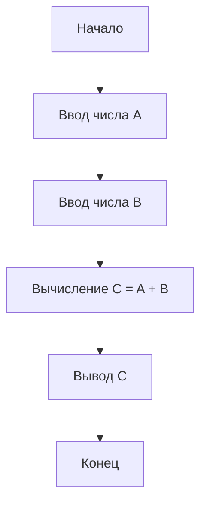
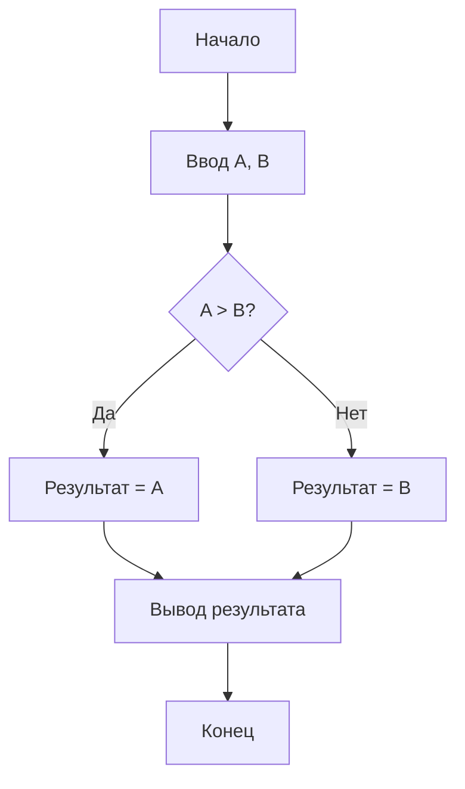

# Лекция 1: Введение в алгоритмизацию

## Введение

Алгоритмизация — это процесс разработки алгоритма, то есть точного описания последовательности действий для решения поставленной задачи. Алгоритмы лежат в основе всей компьютерной науки и программирования. В этой лекции мы рассмотрим основные понятия алгоритмизации, которые помогут нам в дальнейшем освоении программирования на языке Python.

## Основное содержание

### Понятие алгоритма

Алгоритм — это точно определённая последовательность действий, предназначенная для решения определённой задачи или достижения поставленной цели. Алгоритм можно сравнить с кулинарным рецептом: он указывает, какие действия и в какой последовательности нужно выполнить, чтобы получить требуемый результат.

Алгоритмы окружают нас в повседневной жизни: инструкции по сборке мебели, маршруты следования общественного транспорта, правила дорожного движения — всё это примеры алгоритмов.

### Свойства алгоритмов

1. **Дискретность** — алгоритм состоит из отдельных шагов (действий), которые выполняются последовательно друг за другом.

2. **Определённость** — каждое действие алгоритма должно быть чётко и однозначно определено. Исполнитель должен точно знать, что ему нужно сделать на каждом шаге.

3. **Конечность** — алгоритм должен завершаться за конечное число шагов. Это означает, что рано или поздно алгоритм должен дать результат.

4. **Массовость** — алгоритм должен быть применим ко всем задачам данного типа, а не только к конкретному набору исходных данных.

5. **Результативность** — алгоритм должен давать правильный результат при любых допустимых исходных данных.

### Исполнители алгоритмов

Исполнитель алгоритма — это объект или субъект, который выполняет алгоритм. Исполнителем может быть человек, робот, компьютер или любой другой объект, способный воспринимать и выполнять команды алгоритма.

У каждого исполнителя есть своя система команд (СКИ), которую он понимает и может выполнить. Например, исполнитель "Чертёжник" может перемещаться в определённые точки плоскости и проводить линии, а исполнитель "Калькулятор" может выполнять арифметические операции.

Компьютер как исполнитель алгоритмов имеет ограниченный набор базовых команд, но благодаря комбинации этих команд он может выполнять очень сложные задачи.

### Формы записи алгоритмов

Существует несколько способов записи алгоритмов:

1. **Словесная форма** — алгоритм описывается на естественном языке с помощью последовательности команд. Это самый простой способ, но он может быть неоднозначен.

Пример: Алгоритм сложения двух чисел
- Ввести первое число
- Ввести второе число
- Сложить два числа
- Вывести результат

2. **Графическая форма (блок-схемы)** — алгоритм представляется в виде последовательности геометрических фигур (блоков), каждая из которых соответствует определённому типу действия.

Основные блоки в блок-схемах:
- Овал — начало и конец алгоритма
- Параллелограмм — ввод/вывод данных
- Прямоугольник — выполнение действия
- Ромб — проверка условия

### Этапы решения задач на компьютере

Процесс решения задач на компьютере включает в себя следующие этапы:

1. **Постановка задачи** — определение условий задачи, исходных данных и требуемого результата.

2. **Математическое моделирование** — создание математической модели задачи, формулировка зависимости между исходными данными и результатом.

3. **Разработка алгоритма** — составление алгоритма решения задачи с помощью словесного описания или блок-схемы.

4. **Программирование** — запись алгоритма на языке программирования.

5. **Отладка и тестирование** — проверка правильности работы программы на контрольных примерах.

6. **Использование программы** — применение готовой программы для решения задач.

## Практические примеры

Рассмотрим пример составления алгоритма для решения простой задачи: найти максимальное из двух чисел.

Словесное описание алгоритма:
1. Ввести два числа A и B
2. Сравнить A и B
3. Если A больше B, то результат — A
4. Иначе результат — B
5. Вывести результат

Блок-схема алгоритма:

Этот пример демонстрирует, как алгоритм может включать в себя ветвление — выбор одного из нескольких путей выполнения в зависимости от условия.

## Заключение

В этой лекции мы познакомились с основными понятиями алгоритмизации. Мы узнали, что такое алгоритм, какие у него свойства, кто может быть исполнителем алгоритма, и в каких формах можно записывать алгоритмы. Также были рассмотрены этапы решения задач на компьютере.

Понимание алгоритмов — это фундамент программирования. Все программы, которые мы будем писать на языке Python, будут реализовывать те или иные алгоритмы. В следующей лекции мы познакомимся с языком программирования Python, который станет нашим инструментом для реализации алгоритмов.
