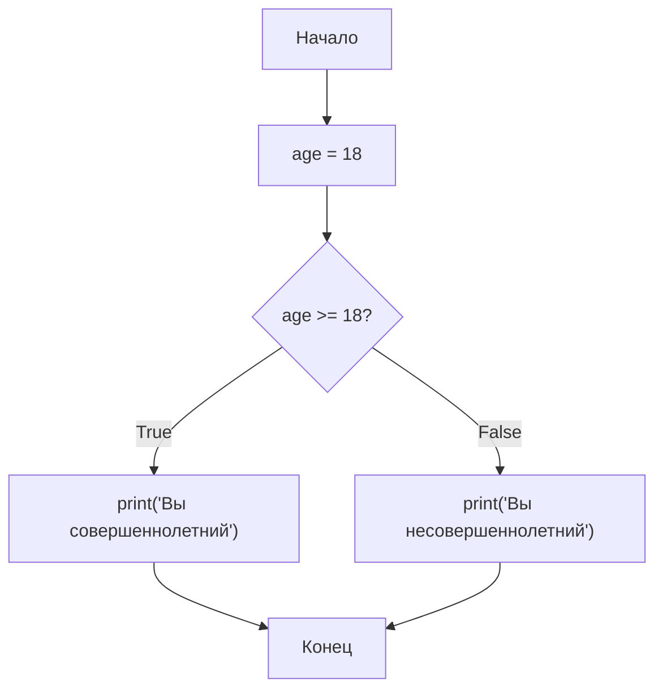
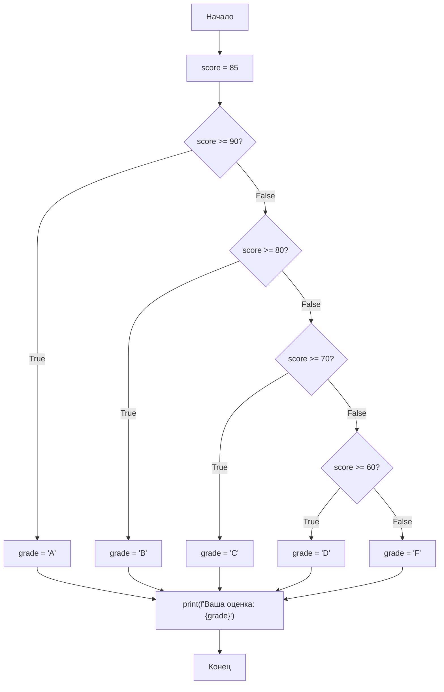
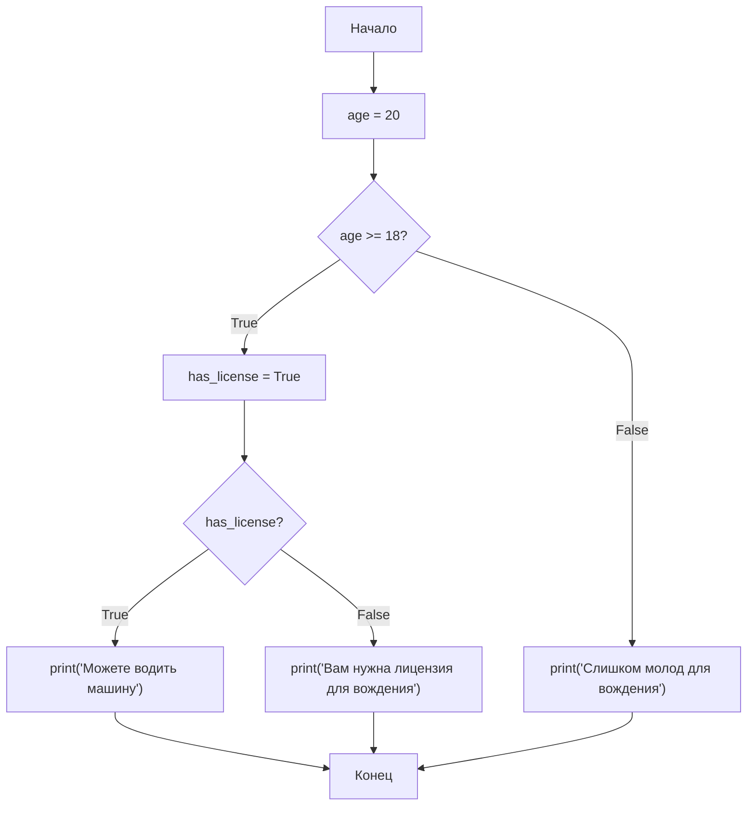
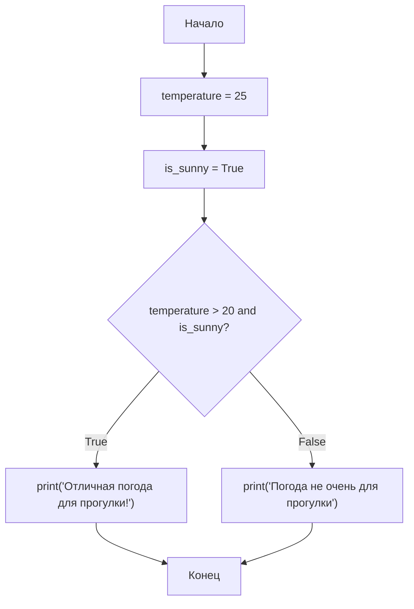
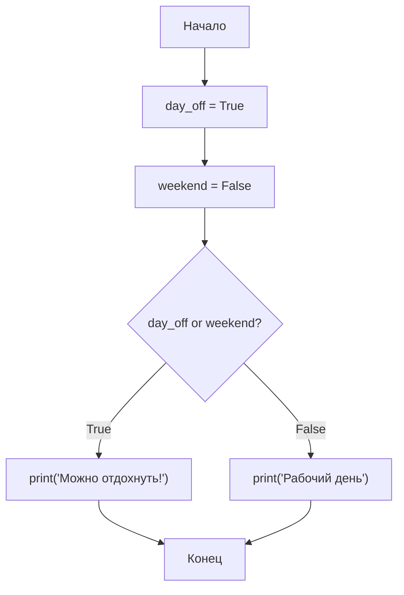
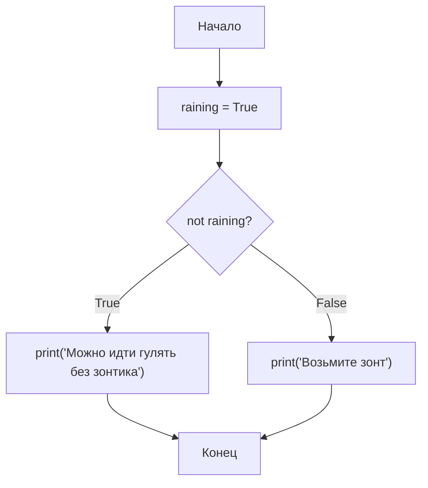
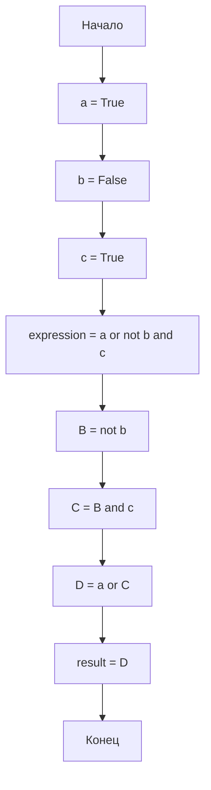
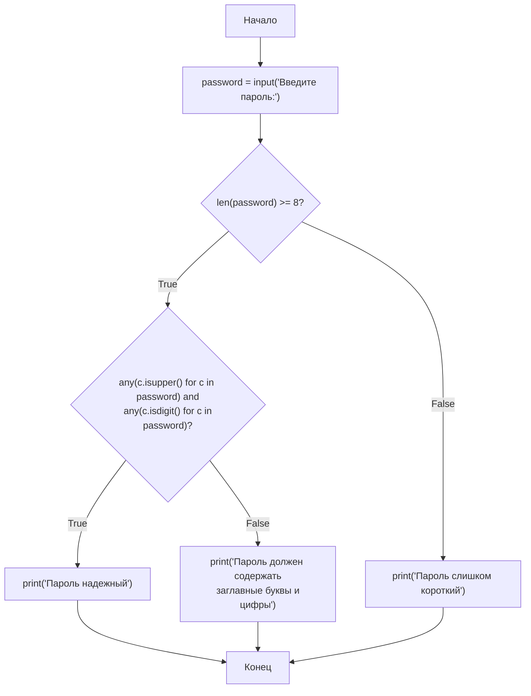
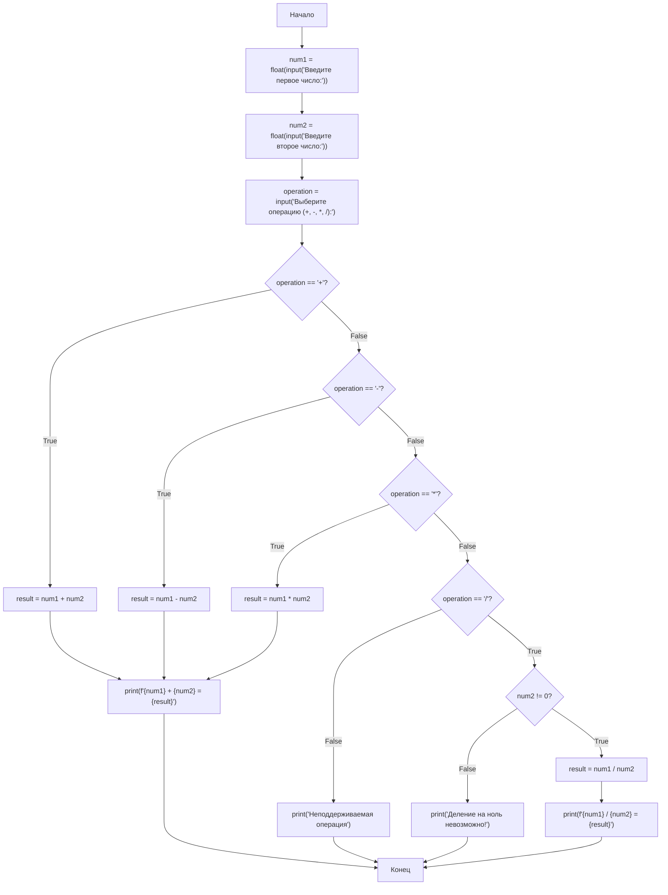
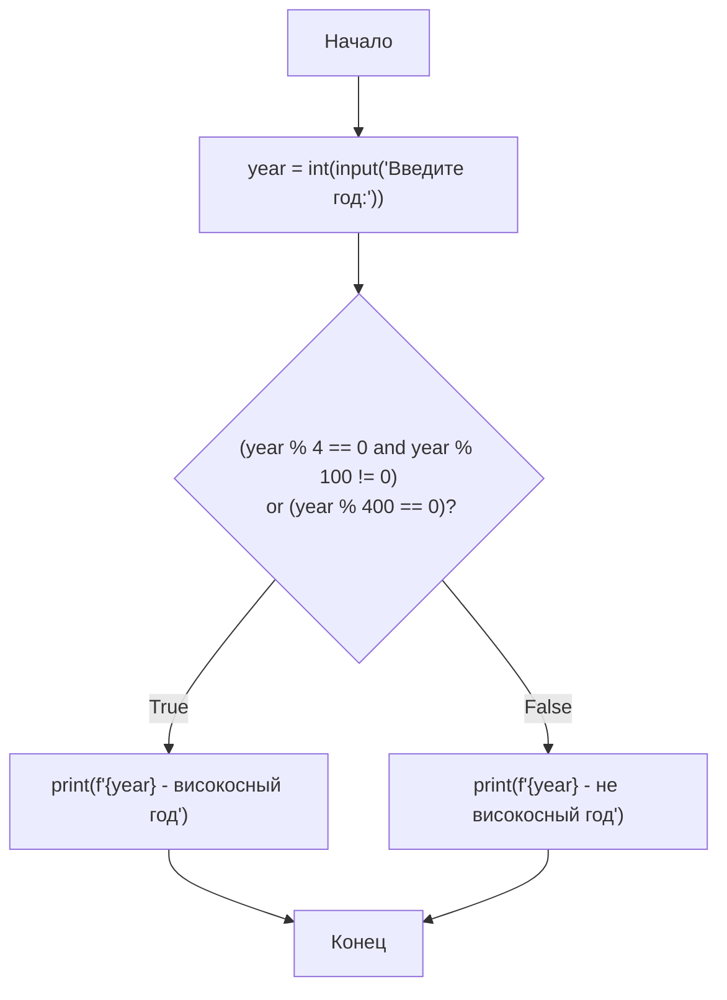

# Лекция 4: Условные конструкции

## Введение

В предыдущих лекциях мы познакомились с типами данных и переменными в Python. Теперь мы рассмотрим одну из важнейших концепций программирования — условные конструкции. Условные конструкции позволяют программе выполнять разные действия в зависимости от различных условий. Это фундаментальный элемент управления потоком выполнения программы, который позволяет создавать гибкий код, способный адаптироваться к различным ситуациям.

## Основное содержание

### Условные конструкции: `if`, `elif`, `else`

Условные конструкции позволяют программе принимать решения на основе проверки условий. В Python условные конструкции реализуются с помощью операторов `if`, `elif` и `else`, которые позволяют организовать ветвление логики программы.

#### Оператор `if`

Оператор `if` позволяет проверить условие и выполнить блок кода, если условие истинно (True).



```python
age = 18
if age >= 18:
    print("Вы совершеннолетний")
```

В этом примере блок кода после `if` выполнится только в том случае, если значение переменной `age` больше или равно 18.

#### Оператор `else`

Оператор `else` позволяет указать блок кода, который будет выполнен, если условие в `if` ложно (False).


```python
age = 16
if age >= 18:
    print("Вы совершеннолетний")
else:
    print("Вы несовершеннолетний")
```

#### Оператор `elif`

Оператор `elif` (сокращение от "else if") позволяет проверить дополнительное условие, если первое условие в `if` оказалось ложным.



```python
score = 85

if score >= 90:
    grade = "A"
elif score >= 80:
    grade = "B"
elif score >= 70:
    grade = "C"
elif score >= 60:
    grade = "D"
else:
    grade = "F"

print(f"Ваша оценка: {grade}")
```

В этом примере программа последовательно проверяет условия, пока не найдет подходящее. Как только условие оказывается истинным, соответствующий блок кода выполняется, а остальные условия пропускаются.

### Вложенные условия

Вложенные условия позволяют создавать более сложную логику, помещая один условный блок внутрь другого.



```python
age = 20
has_license = True

if age >= 18:
    if has_license:
        print("Можете водить машину")
    else:
        print("Вам нужна лицензия для вождения")
else:
    print("Слишком молод для вождения")
```

Также можно использовать логические операторы для создания сложных условий:

```python
age = 20
has_license = True

if age >= 18 and has_license:
    print("Можете водить машину")
elif age >= 18 and not has_license:
    print("Вам нужна лицензия для вождения")
else:
    print("Слишком молод для вождения")
```

### Логические выражения и операторы (`and`, `or`, `not`)

#### Оператор `and`

Оператор `and` возвращает `True`, если оба условия истинны.



```python
temperature = 25
is_sunny = True

if temperature > 20 and is_sunny:
    print("Отличная погода для прогулки!")
```

#### Оператор `or`

Оператор `or` возвращает `True`, если хотя бы одно из условий истинно.



```python
day_off = True
weekend = False

if day_off or weekend:
    print("Можно отдохнуть!")
```

#### Оператор `not`

Оператор `not` инвертирует булевое значение.



```python
raining = True

if not raining:
    print("Можно идти гулять без зонтика")
else:
    print("Возьмите зонт")
```

### Приоритет операторов

При использовании нескольких логических операторов важно понимать их приоритет. Приоритет операторов определяет порядок, в котором операции будут выполняться в выражении. Если в выражении присутствуют несколько логических операторов, они будут вычислены в следующем порядке:

1. `not` (высший приоритет)
2. `and`
3. `or` (низший приоритет)

Это означает, что в выражении без скобок сначала будут выполнены все операции `not`, затем `and`, и в конце `or`. Понимание приоритета операторов критически важно для правильного написания логических выражений.



Примеры:

```python
a = True
b = False
c = True

# Без скобок: сначала not b (дает True), затем and, затем or
result = a or not b and c  # True

# Скобками можно изменить порядок вычисления
result = (a or not b) and c  # True
result = a or (not b and c)  # True
```

Другой пример:

```python
x = True
y = False
z = True

# Выражение без скобок: x or y and z
# Сначала выполняется y and z (дает False), затем x or False (дает True)
result = x or y and z  # True

# Эквивалентное выражение со скобками:
result = x or (y and z)  # True

# Альтернативное выражение:
result = (x or y) and z  # True
```

Как видите, приоритет операторов может значительно повлиять на результат выражения. Поэтому рекомендуется использовать скобки для явного указания порядка выполнения операций, особенно когда выражения становятся сложнее. Это делает код более читаемым и предотвращает ошибки, связанные с неправильным пониманием приоритета операторов.

### Сравнения и операции в условиях

#### Операторы сравнения

Python предоставляет следующие операторы сравнения:

- `==` — равно
- `!=` — не равно
- `<` — меньше
- `>` — больше
- `<=` — меньше или равно
- `>=` — больше или равно

Примеры:

```python
x = 5
y = 10

print(x == y)  # False
print(x != y)  # True
print(x < y)   # True
print(x > y)   # False
print(x <= y)  # True
print(x >= y)  # False
```

#### Операторы принадлежности

- `in` — проверяет, содержится ли значение в последовательности
- `not in` — проверяет, не содержится ли значение в последовательности

```python
fruits = ["яблоко", "банан", "апельсин"]

if "банан" in fruits:
    print("Банан есть в списке")

if "груша" not in fruits:
    print("Груши нет в списке")
```

#### Операторы тождественности

- `is` — проверяет, ссылаются ли две переменные на один и тот же объект
- `is not` — проверяет, ссылаются ли две переменные на разные объекты

```python
a = [1, 2, 3]
b = [1, 2, 3]
c = a

print(a == b)  # True (значения равны)
print(a is b)  # False (разные объекты)
print(a is c)  # True (один и тот же объект)
```

## Практические примеры

### Пример 1: Проверка пароля

В этом примере мы используем вложенные условия и логические операторы для проверки надежности пароля.



```python
password = input("Введите пароль: ")

if len(password) >= 8:
    if any(c.isupper() for c in password) and any(c.isdigit() for c in password):
        print("Пароль надежный")
    else:
        print("Пароль должен содержать заглавные буквы и цифры")
else:
    print("Пароль слишком короткий")
```

### Пример 2: Калькулятор

Калькулятор демонстрирует использование оператора `elif` для выбора одной из нескольких операций, а также вложенные условия для обработки особых случаев.



```python
num1 = float(input("Введите первое число: "))
num2 = float(input("Введите второе число: "))
operation = input("Выберите операцию (+, -, *, /): ")

if operation == "+":
    result = num1 + num2
    print(f"{num1} + {num2} = {result}")
elif operation == "-":
    result = num1 - num2
    print(f"{num1} - {num2} = {result}")
elif operation == "*":
    result = num1 * num2
    print(f"{num1} * {num2} = {result}")
elif operation == "/":
    if num2 != 0:
        result = num1 / num2
        print(f"{num1} / {num2} = {result}")
    else:
        print("Деление на ноль невозможно!")
else:
    print("Неподдерживаемая операция")
```

### Пример 3: Система оценки студентов

Этот пример показывает, как можно использовать последовательность `if-elif-else` для классификации данных:

```mermaid
flowchart TD
    A[Начало] --> B[score = int(input("Введите оценку (0-100):"))]
    B --> C{score >= 90?}
    C -->|True| D[grade = "A"]
    C -->|False| E{score >= 80?}
    D --> F[print(f"Ваша оценка: {grade}")]
    E -->|True| G[grade = "B"]
    E -->|False| H{score >= 70?}
    G --> F
    H -->|True| I[grade = "C"]
    H -->|False| J{score >= 60?}
    I --> F
    J -->|True| K[grade = "D"]
    J -->|False| L[grade = "F"]
    K --> F
    L --> F
    F --> M[Конец]
```

```python
score = int(input("Введите оценку (0-100): "))

if score >= 90:
    grade = "A"
elif score >= 80:
    grade = "B"
elif score >= 70:
    grade = "C"
elif score >= 60:
    grade = "D"
else:
    grade = "F"

print(f"Ваша оценка: {grade}")
```

### Пример 4: Проверка високосного года

В этом примере используется комбинация логических операторов для проверки сложного условия:



```python
year = int(input("Введите год: "))

if (year % 4 == 0 and year % 100 != 0) or (year % 400 == 0):
    print(f"{year} - високосный год")
else:
    print(f"{year} - не високосный год")
```

## Заключение

Условные конструкции являются важным инструментом для управления потоком выполнения программы. Они позволяют создавать гибкий код, который может адаптироваться к различным ситуациям. Понимание работы с логическими операторами и приоритетом операций в условиях помогает писать более эффективный и безопасный код.

На этой лекции мы рассмотрели следующие ключевые моменты:

1. **Операторы ветвления**: `if`, `elif`, `else` - основные элементы условных конструкций, позволяющие программе принимать решения на основе проверки условий.

2. **Вложенные условия**: возможность размещения одного условного блока внутри другого для создания более сложной логики.

3. **Логические операторы**: `and`, `or`, `not` - позволяют комбинировать простые условия в более сложные логические выражения.

4. **Приоритет операторов**: знание приоритета логических операторов (`not` > `and` > `or`) помогает правильно строить сложные условия и избегать ошибок.

5. **Операторы сравнения**: `==`, `!=`, `<`, `>`, `<=`, `>=` - позволяют сравнивать значения.

6. **Операторы принадлежности**: `in`, `not in` - позволяют проверять наличие элемента в последовательности.

7. **Операторы тождественности**: `is`, `is not` - позволяют проверять, ссылаются ли переменные на один и тот же объект.

Условные конструкции - это фундаментальный элемент программирования, без которого невозможно создать ни одну серьезную программу. Они позволяют вашему коду "думать" и принимать решения на основе входных данных или состояния программы. Умение эффективно использовать условные конструкции - один из ключевых навыков программиста.

В следующей лекции мы рассмотрим циклы, которые позволяют повторять выполнение блоков кода до тех пор, пока выполняется определенное условие.
