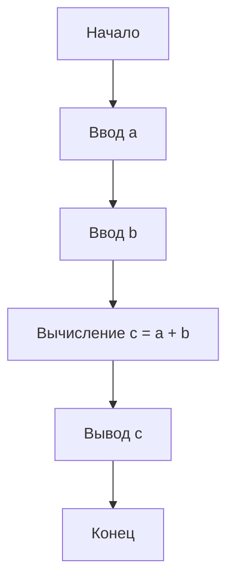
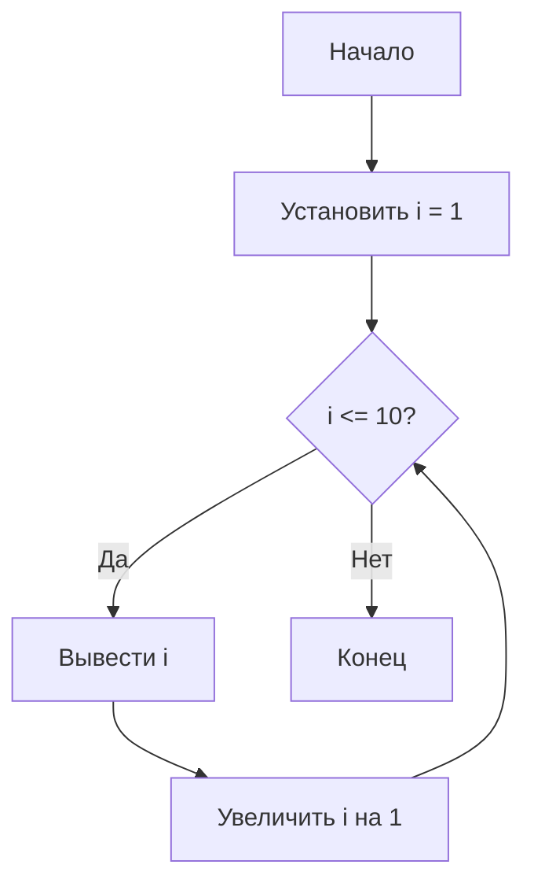

# Лекция 14: Алгоритмические конструкции: повторение и обобщение

## Введение

После изучения различных аспектов программирования на Python, включая переменные, типы данных, условные операторы, циклы, функции и объектно-ориентированное программирование, важно обобщить знания об алгоритмических конструкциях. Алгоритмические конструкции - это базовые структуры, из которых строятся все алгоритмы. В этой лекции мы рассмотрим три основные алгоритмические конструкции: линейные, разветвляющиеся и циклические, а также покажем, как они реализуются в Python.

## Основное содержание

### Основные алгоритмические конструкции

В программировании выделяют три основных типа алгоритмических конструкций:

1. **Следование (линейный алгоритм)** - последовательное выполнение команд
2. **Ветвление (разветвляющийся алгоритм)** - выполнение различных команд в зависимости от условия
3. **Повторение (циклический алгоритм)** - многократное выполнение команд

### Линейные алгоритмы

Линейный алгоритм - это алгоритм, в котором команды выполняются последовательно, одна за другой, без ветвлений и повторений.

```python
# Пример линейного алгоритма: вычисление площади прямоугольника
length = float(input("Введите длину: "))
width = float(input("Введите ширину: "))
area = length * width
print(f"Площадь прямоугольника: {area}")

# Пример линейного алгоритма: конвертация температуры
celsius = float(input("Введите температуру в Цельсиях: "))
fahrenheit = celsius * 9/5 + 32
kelvin = celsius + 273.15
print(f"Температура в Фаренгейтах: {fahrenheit}")
print(f"Температура в Кельвинах: {kelvin}")
```

### Разветвляющиеся алгоритмы

Разветвляющийся алгоритм - это алгоритм, в котором в зависимости от выполнения или невыполнения некоторого условия выбирается один из нескольких возможных путей выполнения.

```python
# Пример разветвляющегося алгоритма: определение времени года
month = int(input("Введите номер месяца (1-12): "))

if month in [12, 1, 2]:
    season = "зима"
elif month in [3, 4, 5]:
    season = "весна"
elif month in [6, 7, 8]:
    season = "лето"
elif month in [9, 10, 11]:
    season = "осень"
else:
    season = "некорректный месяц"

print(f"Время года: {season}")

# Пример сложного ветвления: определение типа треугольника
side1 = float(input("Введите длину первой стороны: "))
side2 = float(input("Введите длину второй стороны: "))
side3 = float(input("Введите длину третьей стороны: "))

# Проверка существования треугольника
if side1 + side2 > side3 and side1 + side3 > side2 and side2 + side3 > side1:
    # Определение типа треугольника
    if side1 == side2 == side3:
        triangle_type = "равносторонний"
    elif side1 == side2 or side1 == side3 or side2 == side3:
        triangle_type = "равнобедренный"
    else:
        triangle_type = "разносторонний"
    
    print(f"Треугольник существует и является {triangle_type}")
else:
    print("Треугольник с такими сторонами не существует")
```

### Циклические алгоритмы

Циклический алгоритм - это алгоритм, в котором некоторая последовательность команд повторяется несколько раз.

#### Цикл for

```python
# Пример: вычисление факториала числа
n = int(input("Введите число: "))
factorial = 1

for i in range(1, n + 1):
    factorial *= i

print(f"Факториал {n} равен {factorial}")

# Пример: сумма элементов списка
numbers = [1, 2, 3, 4, 5, 6, 7, 8, 9, 10]
total = 0

for num in numbers:
    total += num

print(f"Сумма чисел: {total}")

# Пример: таблица умножения
for i in range(1, 10):
    for j in range(1, 10):
        print(f"{i} x {j} = {i*j}", end="\t")
    print()  # переход на новую строку
```

#### Цикл while

```python
# Пример: вычисление НОД (алгоритм Евклида)
def gcd(a, b):
    while b != 0:
        temp = b
        b = a % b
        a = temp
    return a

num1 = int(input("Введите первое число: "))
num2 = int(input("Введите второе число: "))
result = gcd(num1, num2)
print(f"НОД({num1}, {num2}) = {result}")

# Пример: игра "Угадай число"
import random

secret_number = random.randint(1, 100)
attempts = 0
guess = 0

print("Угадайте число от 1 до 100")

while guess != secret_number:
    guess = int(input("Введите ваше предположение: "))
    attempts += 1
    
    if guess < secret_number:
        print("Загаданное число больше")
    elif guess > secret_number:
        print("Загаданное число меньше")
    else:
        print(f"Поздравляем! Вы угадали число за {attempts} попыток")

# Пример: числа Фибоначчи
n = int(input("Сколько чисел Фибоначчи вывести: "))
a, b = 0, 1
count = 0

while count < n:
    print(a, end=" ")
    a, b = b, a + b
    count += 1
print()
```

### Комбинация алгоритмических конструкций

Реальные программы обычно используют комбинацию всех трех конструкций:

```python
def analyze_numbers():
    """Программа для анализа последовательности чисел"""
    numbers = []
    print("Введите числа (введите 0 для завершения):")
    
    # Цикл для ввода чисел
    while True:
        num = float(input("Введите число: "))
        if num == 0:
            break
        numbers.append(num)
    
    # Проверка, есть ли числа для анализа
    if len(numbers) == 0:
        print("Не введено ни одного числа")
        return
    
    # Линейные вычисления
    total = sum(numbers)
    count = len(numbers)
    average = total / count
    
    # Разветвление для определения типа последовательности
    if all(x > 0 for x in numbers):
        sequence_type = "все положительные"
    elif all(x < 0 for x in numbers):
        sequence_type = "все отрицательные"
    else:
        sequence_type = "смешанная"
    
    # Цикл для нахождения максимального и минимального
    max_num = numbers[0]
    min_num = numbers[0]
    
    for num in numbers[1:]:
        if num > max_num:
            max_num = num
        if num < min_num:
            min_num = num
    
    # Вывод результатов
    print(f"\nАнализ последовательности:")
    print(f"Количество чисел: {count}")
    print(f"Сумма: {total}")
    print(f"Среднее: {average:.2f}")
    print(f"Минимум: {min_num}")
    print(f"Максимум: {max_num}")
    print(f"Тип последовательности: {sequence_type}")

# Вызов функции
analyze_numbers()
```

### Блок-схемы алгоритмов

Блок-схемы помогают визуализировать алгоритмические конструкции:

#### Линейный алгоритм:


#### Разветвляющийся алгоритм:
```mermaid
flowchart TD
    A[Начало] --> B[Ввод числа x]
    B --> C{x > 0?}
    C -->|Да| D[Вывод "Положительное"]
    C -->|Нет| E{x < 0?}
    E -->|Да| F[Вывод "Отрицательное"]
    E -->|Нет| G[Вывод "Ноль"]
    D --> H[Конец]
    F --> H
    G --> H
```

#### Циклический алгоритм:


### Структурное программирование

Структурное программирование - это методология программирования, основанная на использовании только трех основных алгоритмических конструкций и их комбинаций. Основные принципы:

1. **Принцип последовательности** - команды выполняются в том порядке, в котором они записаны
2. **Принцип ветвления** - выбор одного из нескольких путей выполнения
3. **Принцип цикла** - повторение команд до выполнения условия

Пример структурированной программы:

```python
def calculate_expression():
    """
    Программа для вычисления значения выражения:
    если x > 0, то вычислить sqrt(x) + x^2
    иначе, если x < 0, то вычислить |x| * 2
    иначе вывести 0
    """
    import math
    
    x = float(input("Введите значение x: "))
    
    if x > 0:
        result = math.sqrt(x) + x**2
        print(f"Результат: sqrt({x}) + {x}^2 = {result}")
    elif x < 0:
        result = abs(x) * 2
        print(f"Результат: |{x}| * 2 = {result}")
    else:  # x == 0
        result = 0
        print(f"Результат: {result}")
    
    return result

def find_prime_numbers(limit):
    """Нахождение всех простых чисел до заданного предела (решето Эратосфена)"""
    if limit < 2:
        return []
    
    # Инициализация списка
    primes = [True] * (limit + 1)
    primes[0] = primes[1] = False
    
    # Основной цикл алгоритма
    for i in range(2, int(limit**0.5) + 1):
        if primes[i]:
            # Цикл для отметки кратных чисел как составных
            for j in range(i*i, limit + 1, i):
                primes[j] = False
    
    # Формирование результата
    result = []
    for i in range(2, limit + 1):
        if primes[i]:
            result.append(i)
    
    return result

# Пример использования
calculate_expression()
prime_list = find_prime_numbers(30)
print(f"Простые числа до 30: {prime_list}")
```

### Практические примеры комбинированных алгоритмов

#### Пример 1: Калькулятор с историей операций

```python
class Calculator:
    def __init__(self):
        self.history = []
    
    def add(self, a, b):
        result = a + b
        self.history.append(f"{a} + {b} = {result}")
        return result
    
    def subtract(self, a, b):
        result = a - b
        self.history.append(f"{a} - {b} = {result}")
        return result
    
    def multiply(self, a, b):
        result = a * b
        self.history.append(f"{a} * {b} = {result}")
        return result
    
    def divide(self, a, b):
        if b == 0:
            self.history.append(f"Ошибка: деление на ноль ({a} / {b})")
            return None
        result = a / b
        self.history.append(f"{a} / {b} = {result}")
        return result
    
    def show_history(self):
        print("История вычислений:")
        for record in self.history:
            print(record)

def calculator_program():
    calc = Calculator()
    
    while True:
        print("\nКалькулятор")
        print("1. Сложение")
        print("2. Вычитание")
        print("3. Умножение")
        print("4. Деление")
        print("5. История")
        print("6. Выход")
        
        choice = input("Выберите операцию (1-6): ")
        
        if choice == '6':
            break
        elif choice in ['1', '2', '3', '4']:
            try:
                a = float(input("Введите первое число: "))
                b = float(input("Введите второе число: "))
                
                if choice == '1':
                    result = calc.add(a, b)
                elif choice == '2':
                    result = calc.subtract(a, b)
                elif choice == '3':
                    result = calc.multiply(a, b)
                elif choice == '4':
                    result = calc.divide(a, b)
                
                if result is not None:
                    print(f"Результат: {result}")
                    
            except ValueError:
                print("Ошибка: введите числовое значение")
        elif choice == '5':
            calc.show_history()
        else:
            print("Неверный выбор")

# Запуск калькулятора
calculator_program()
```

#### Пример 2: Анализ текста

```python
def analyze_text(text):
    """Функция для анализа текста"""
    # Линейные вычисления
    char_count = len(text)
    word_count = len(text.split())
    
    # Подсчет предложений
    sentence_endings = '.!?' 
    sentence_count = 0
    for char in text:
        if char in sentence_endings:
            sentence_count += 1
    
    # Подсчет гласных и согласных
    vowels = 'аеёиоуыэюяaeiou'
    consonants = 'бвгджзйклмнпрстфхцчшщbcdfghjklmnpqrstvwxyz'
    
    vowel_count = 0
    consonant_count = 0
    
    for char in text.lower():
        if char in vowels:
            vowel_count += 1
        elif char in consonants:
            consonant_count += 1
    
    # Разветвление для определения типа текста
    if sentence_count == 0:
        text_type = "пустой или без знаков препинания"
    elif sentence_count == 1:
        text_type = "одно предложение"
    elif sentence_count <= 3:
        text_type = "короткий текст"
    else:
        text_type = "длинный текст"
    
    # Возвращаем результат
    return {
        'characters': char_count,
        'words': word_count,
        'sentences': sentence_count,
        'vowels': vowel_count,
        'consonants': consonant_count,
        'type': text_type
    }

def text_analysis_program():
    """Программа для анализа текста"""
    print("Введите текст для анализа (введите 'quit' для завершения):")
    
    while True:
        text = input("\n> ")
        
        if text.lower() == 'quit':
            break
        
        # Вызов функции анализа
        analysis = analyze_text(text)
        
        # Вывод результатов
        print("\nРезультаты анализа:")
        print(f"Количество символов: {analysis['characters']}")
        print(f"Количество слов: {analysis['words']}")
        print(f"Количество предложений: {analysis['sentences']}")
        print(f"Количество гласных: {analysis['vowels']}")
        print(f"Количество согласных: {analysis['consonants']}")
        print(f"Тип текста: {analysis['type']}")

# Запуск программы анализа текста
text_analysis_program()
```

## Заключение

В этой лекции мы обобщили знания об основных алгоритмических конструкциях:

1. **Линейные алгоритмы** - последовательное выполнение команд
2. **Разветвляющиеся алгоритмы** - выполнение различных команд в зависимости от условий
3. **Циклические алгоритмы** - многократное выполнение команд

Мы рассмотрели, как каждая из этих конструкций реализуется в Python, и показали, как они могут комбинироваться для решения более сложных задач. Понимание этих базовых конструкций является фундаментом для написания эффективных и понятных программ.

В следующей лекции мы рассмотрим базовые алгоритмы поиска и сортировки, которые строятся на основе этих основных конструкций.
