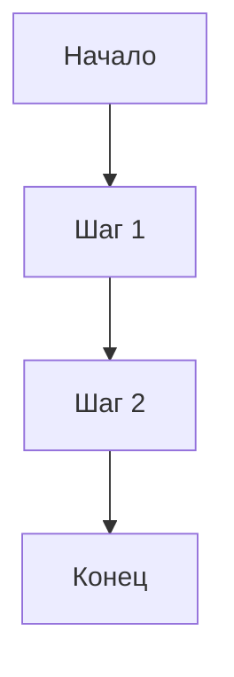

# Лекция: [Название темы]

## Введение

Краткое введение в тему лекции, объяснение её значимости и связи с предыдущими темами.

## Основное содержание

### Подтема 1

Подробное объяснение первой подтемы с примерами кода и пояснениями.

```python
# Пример кода
print("Пример кода")
```

### Подтема 2

Объяснение второй подтемы с дополнительными примерами.



## Практические примеры

Несколько практических примеров применения изученного материала.

## Заключение

Краткое резюме лекции, подведение итогов и связь с будущими темами.
