# Лекция по Python: Условные конструкции

## Введение

Условные конструкции позволяют программе выполнять разные действия в зависимости от различных условий. Это фундаментальный элемент управления потоком выполнения программы. Условные операторы позволяют принимать решения в процессе выполнения программы, основываясь на истинность или ложность определенных условий. Они играют ключевую роль в создании гибких и адаптивных программ, способных реагировать на различные ситуации.

В Python условные конструкции реализуются с помощью операторов `if`, `elif` и `else`, которые позволяют организовать ветвление логики программы. Эти операторы работают совместно с логическими выражениями, результат которых может быть истинным (True) или ложным (False).

Условные конструкции также тесно связаны с понятием булевой алгебры, где используются логические операторы `and`, `or`, и `not` для комбинирования простых условий в более сложные логические выражения.

## Операторы ветвления: `if`, `elif`, `else`

### Оператор `if`

Оператор `if` позволяет проверить условие и выполнить блок кода, если условие истинно (True).

```python
age = 18
if age >= 18:
    print("Вы совершеннолетний")
```

В этом примере блок кода после `if` выполнится только в том случае, если значение переменной `age` больше или равно 18.

### Оператор `else`

Оператор `else` позволяет указать блок кода, который будет выполнен, если условие в `if` ложно (False).
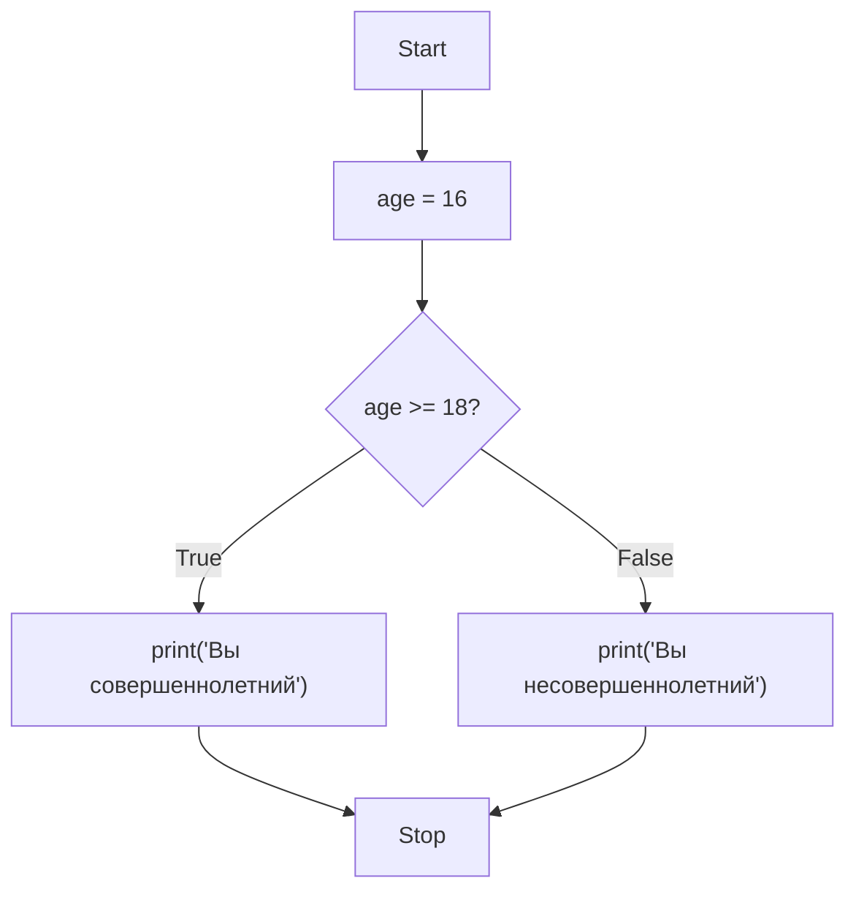
```python
age = 16
if age >= 18:
    print("Вы совершеннолетний")
else:
    print("Вы несовершеннолетний")
```

### Оператор `elif`

Оператор `elif` (сокращение от "else if") позволяет проверить дополнительное условие, если первое условие в `if` оказалось ложным.
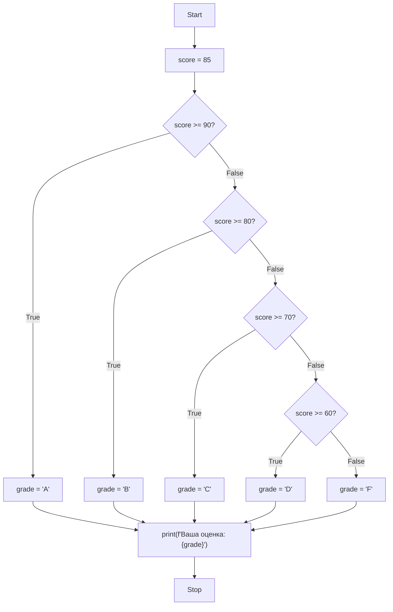
```python
score = 85

if score >= 90:
    grade = "A"
elif score >= 80:
    grade = "B"
elif score >= 70:
    grade = "C"
elif score >= 60:
    grade = "D"
else:
    grade = "F"

print(f"Ваша оценка: {grade}")
```

В этом примере программа последовательно проверяет условия, пока не найдет подходящее. Как только условие оказывается истинным, соответствующий блок кода выполняется, а остальные условия пропускаются.

## Вложенные условия

Вложенные условия позволяют создавать более сложную логику, помещая один условный блок внутрь другого.
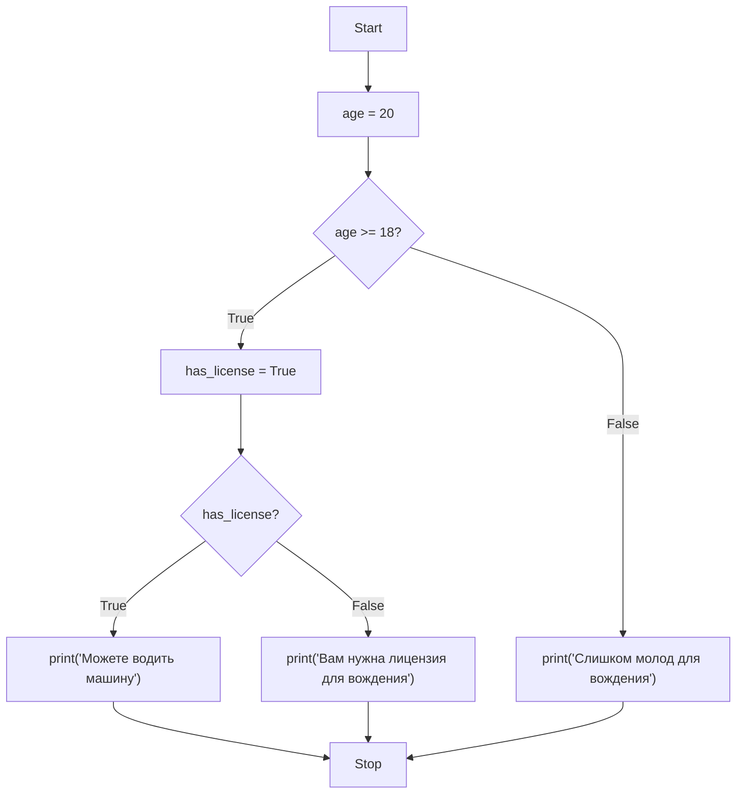
```python
age = 20
has_license = True

if age >= 18:
    if has_license:
        print("Можете водить машину")
    else:
        print("Вам нужна лицензия для вождения")
else:
    print("Слишком молод для вождения")
```

Также можно использовать логические операторы для создания сложных условий:

```python
age = 20
has_license = True

if age >= 18 and has_license:
    print("Можете водить машину")
elif age >= 18 and not has_license:
    print("Вам нужна лицензия для вождения")
else:
    print("Слишком молод для вождения")
```

## Логические выражения и операторы (`and`, `or`, `not`)

### Оператор `and`

Оператор `and` возвращает `True`, если оба условия истинны.
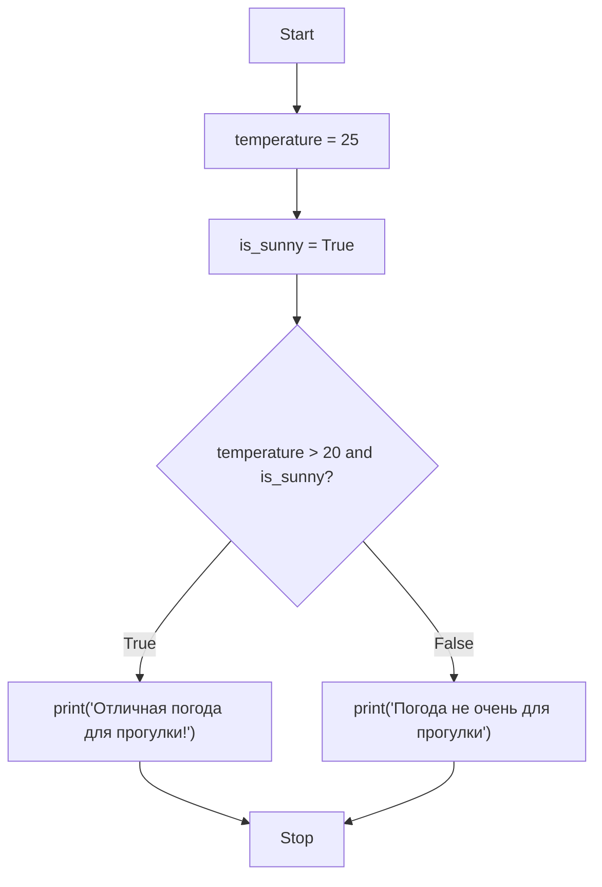
```python
temperature = 25
is_sunny = True

if temperature > 20 and is_sunny:
    print("Отличная погода для прогулки!")
```

### Оператор `or`

Оператор `or` возвращает `True`, если хотя бы одно из условий истинно.
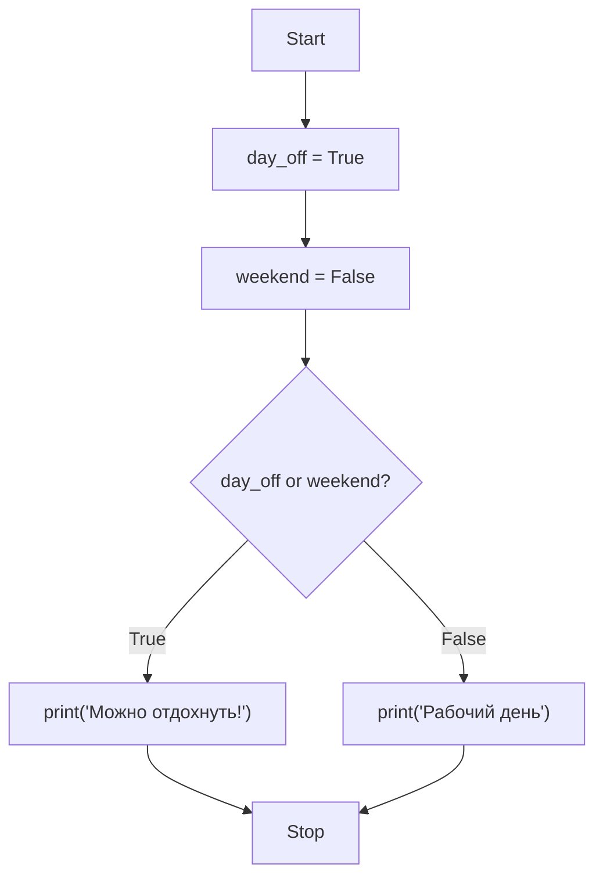
```python
day_off = True
weekend = False

if day_off or weekend:
    print("Можно отдохнуть!")
```

### Оператор `not`

Оператор `not` инвертирует булевое значение.
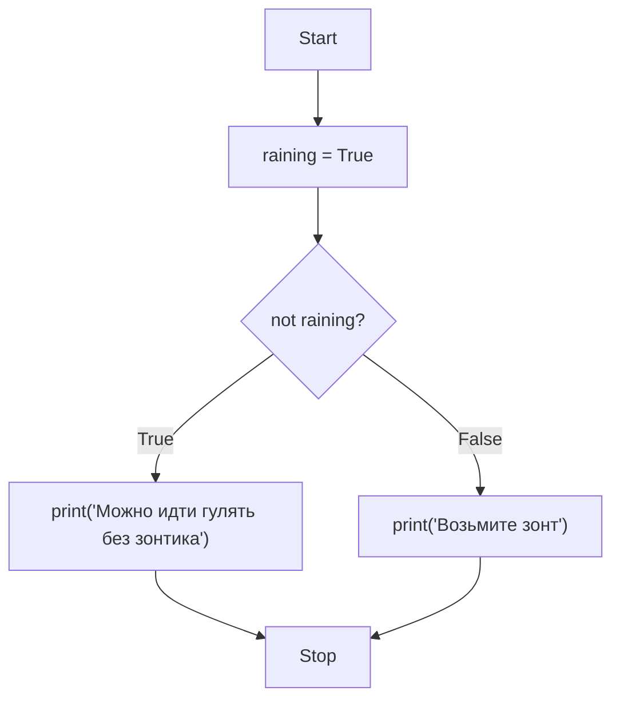
```python
raining = True

if not raining:
    print("Можно идти гулять без зонтика")
else:
    print("Возьмите зонт")
```

## Приоритет операторов

При использовании нескольких логических операторов важно понимать их приоритет. Приоритет операторов определяет порядок, в котором операции будут выполняться в выражении. Если в выражении присутствуют несколько логических операторов, они будут вычислены в следующем порядке:

1. `not` (высший приоритет)
2. `and`
3. `or` (низший приоритет)

Это означает, что в выражении без скобок сначала будут выполнены все операции `not`, затем `and`, и в конце `or`. Понимание приоритета операторов критически важно для правильного написания логических выражений.
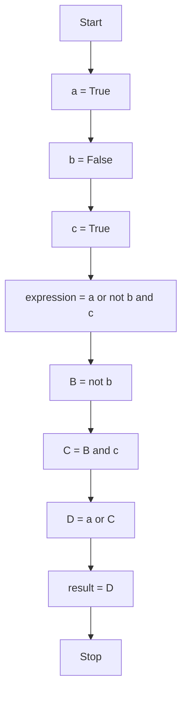
Примеры:

```python
a = True
b = False
c = True

# Без скобок: сначала not b (дает True), затем and, затем or
result = a or not b and c  # True

# Скобками можно изменить порядок вычисления
result = (a or not b) and c  # True
result = a or (not b and c)  # True
```

Другой пример:

```python
x = True
y = False
z = True

# Выражение без скобок: x or y and z
# Сначала выполняется y and z (дает False), затем x or False (дает True)
result = x or y and z  # True

# Эквивалентное выражение со скобками:
result = x or (y and z)  # True

# Альтернативное выражение:
result = (x or y) and z  # True
```

Как видите, приоритет операторов может значительно повлиять на результат выражения. Поэтому рекомендуется использовать скобки для явного указания порядка выполнения операций, особенно когда выражения становятся сложнее. Это делает код более читаемым и предотвращает ошибки, связанные с неправильным пониманием приоритета операторов.

## Операции и преобразование типов в условиях

### Приведение типов в условиях

В Python любое значение может быть преобразовано к булевому типу. Этот процесс называется "истинностью" (truthiness) значения. При использовании значения в логическом контексте (например, в условии `if`) Python автоматически преобразует его к булевому типу.

Следующие значения интерпретируются как `False` (их называют "ложными" или "falsy"):
- `False` (явно ложь)
- `None` (отсутствие значения)
- `0` (нуль в числовом виде)
- `0.0` (ноль с плавающей точкой)
- Пустая строка `""`
- Пустой список `[]`
- Пустой кортеж `()`
- Пустой словарь `{}`
- Пустое множество `set()`
- Пустой frozenset()
- Пустой range(0)

Все остальные значения интерпретируются как `True` (их называют "истинными" или "truthy").
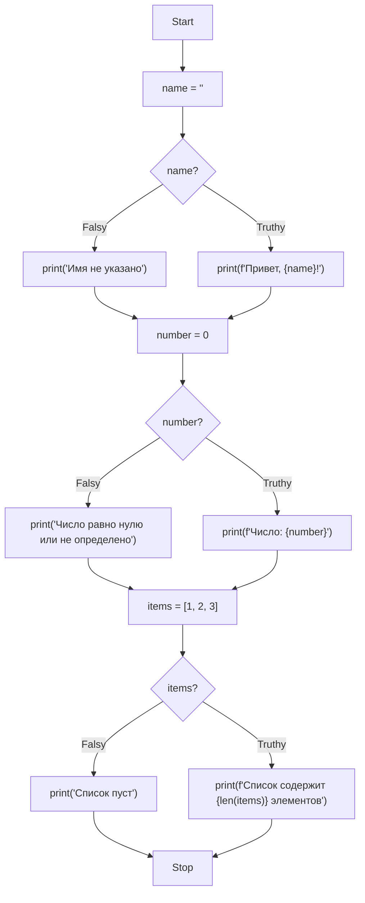
```python
# Проверка на пустую строку
name = ""
if name:
    print(f"Привет, {name}!")
else:
    print("Имя не указано")

# Проверка на ноль
number = 0
if number:
    print(f"Число: {number}")
else:
    print("Число равно нулю или не определено")

# Проверка списка
items = [1, 2, 3]
if items:
    print(f"Список содержит {len(items)} элементов")
else:
    print("Список пуст")

# Дополнительные примеры
empty_list = []
if empty_list:
    print("Список не пустой")
else:
    print("Список пустой")  # Будет напечатано

positive_number = 5
if positive_number:
    print(f"Число {positive_number} является истинным")  # Будет напечатано

negative_number = -3
if negative_number:
    print(f"Число {negative_number} является истинным")  # Будет напечатано

zero_float = 0.0
if zero_float:
    print("Это не будет напечатано")
else:
    print("Число 0.0 является ложным")  # Будет напечатано

none_value = None
if none_value:
    print("Это не будет напечатано")
else:
    print("None является ложным")  # Будет напечатано
```

Понимание того, какие значения считаются "истинными", а какие "ложными", крайне важно при написании условий. Это позволяет писать более компактный и читаемый код, не используя явные сравнения с `None` или `0` в тех случаях, когда это не требуется.

### Явное преобразование типов

Иногда необходимо явно преобразовать типы данных перед сравнением. Это особенно важно при работе с пользовательским вводом, данными из файлов или баз данных, где информация может быть представлена в неподходящем для сравнения формате.
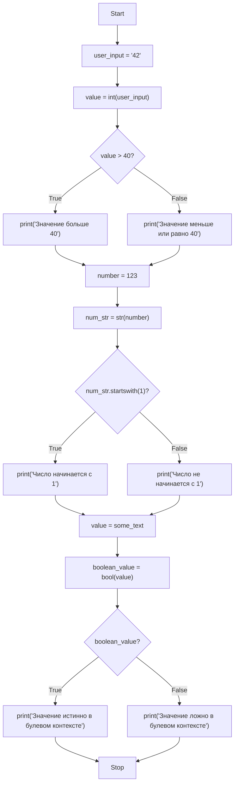
```python
# Преобразование строки в число
user_input = "42"
if int(user_input) > 40:
    print("Значение больше 40")

# Преобразование числа в строку для проверки
number = 123
if str(number).startswith("1"):
    print("Число начинается с 1")

# Преобразование к булевому значению
value = "some_text"
if bool(value):
    print("Значение истинно в булевом контексте")

# Дополнительные примеры преобразования типов
price = "19.99"
if float(price) > 10.0:
    print("Цена больше 10.0")

# Проверка длины строки после преобразования числа
count = 5
if len(str(count)) == 1:
    print("Число однозначное")

# Преобразование строки в список и проверка
text = "hello"
if len(list(text)) > 3:
    print("Строка содержит более 3 символов")

# Преобразование в сет для проверки уникальности
data = [1, 2, 2, 3]
if len(data) != len(set(data)):
    print("В списке есть дубликаты")

# Преобразование в нижний регистр для сравнения
word = "Hello"
if word.lower() == "hello":
    print("Слова совпадают без учета регистра")
```

При явном преобразовании типов важно помнить о потенциальных ошибках, которые могут возникнуть при некорректных данных. Всегда стоит учитывать возможность возникновения исключений и обрабатывать их соответствующим образом.

### Осторожность при преобразовании типов

При работе с пользовательским вводом всегда следует обрабатывать возможные ошибки. Это особенно важно при преобразовании типов, так как пользователь может ввести данные в непредусмотренном формате, что приведет к исключениям.
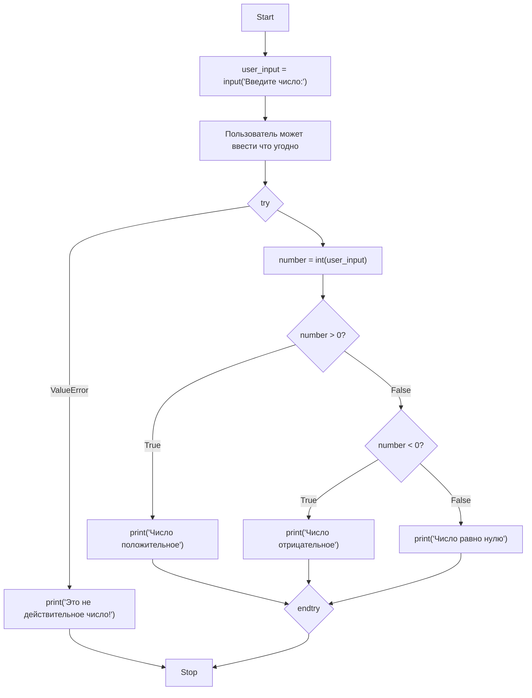
```python
try:
    user_input = input("Введите число: ")
    number = int(user_input)
    
    if number > 0:
        print("Число положительное")
    elif number < 0:
        print("Число отрицательное")
    else:
        print("Число равно нулю")
except ValueError:
    print("Это не действительное число!")
```

Обработка исключений особенно важна при работе с внешними источниками данных, такими как файлы, базы данных или API. Ниже приведены дополнительные примеры правильной обработки потенциальных ошибок при преобразовании типов:

```python
# Обработка преобразования вещественных чисел
def safe_float_conversion(user_input):
    try:
        number = float(user_input)
        if number > 0:
            return "Число положительное"
        elif number < 0:
            return "Число отрицательное"
        else:
            return "Число равно нулю"
    except ValueError:
        return "Не удалось преобразовать в число"

# Пример использования
print(safe_float_conversion("3.14"))  # Число положительное
print(safe_float_conversion("abc"))   # Не удалось преобразовать в число

# Обработка деления на ноль в условиях
def safe_division(a, b):
    try:
        if b != 0:
            result = a / b
            if result > 1:
                return f"Результат больше 1: {result}"
            else:
                return f"Результат меньше или равен 1: {result}"
        else:
            return "Деление на ноль невозможно"
    except TypeError:
        return "Неверный тип данных"

# Примеры использования
print(safe_division(10, 3))  # Результат больше 1: 3.333333335
print(safe_division(10, 0))  # Деление на ноль невозможно

# Обработка индексов в списках
def safe_list_access(lst, index):
    try:
        if isinstance(lst, list) and len(lst) > 0:
            element = lst[index]
            if element > 0:
                return f"Элемент положительный: {element}"
            elif element < 0:
                return f"Элемент отрицательный: {element}"
            else:
                return f"Элемент равен нулю: {element}"
        else:
            return "Список пуст или не является списком"
    except IndexError:
        return "Индекс вне диапазона"
    except TypeError:
        return "Неверный тип индекса"

# Примеры использования
print(safe_list_access([1, 2, 3], 1))  # Элемент положительный: 2
print(safe_list_access([1, 2, 3], 10)) # Индекс вне диапазона

# Проверка и преобразование строк
def validate_and_convert_age(age_string):
    try:
        age = int(age_string)
        if age < 0:
            return "Возраст не может быть отрицательным"
        elif age > 150:
            return "Возраст слишком большой"
        elif age >= 18:
            return "Совершеннолетний"
        else:
            return "Несовершеннолетний"
    except ValueError:
        return "Некорректный формат возраста"

# Примеры использования
print(validate_and_convert_age("25"))    # Совершеннолетний
print(validate_and_convert_age("-5"))    # Возраст не может быть отрицательным
print(validate_and_convert_age("abc"))   # Некорректный формат возраста
```

При написании условных конструкций с преобразованием типов всегда помните о следующих моментах:
1. Пользовательский ввод может быть произвольным
2. Преобразование типов может вызвать исключения
3. Важно проверять границы допустимых значений
4. Используйте блоки try-except для безопасной обработки потенциальных ошибок
5. Рассматривайте различные сценарии использования и тестирование

## Практические примеры

### Пример 1: Проверка пароля

В этом примере мы используем вложенные условия и логические операторы для проверки надежности пароля.

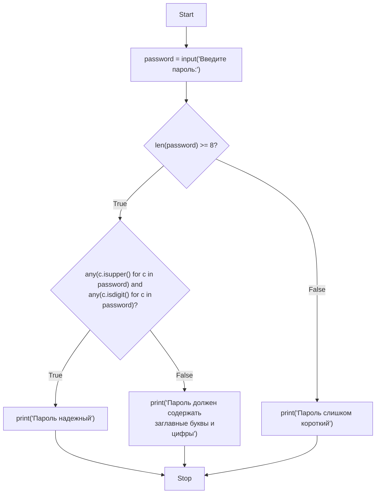

```python
password = input("Введите пароль: ")

if len(password) >= 8:
    if any(c.isupper() for c in password) and any(c.isdigit() for c in password):
        print("Пароль надежный")
    else:
        print("Пароль должен содержать заглавные буквы и цифры")
else:
    print("Пароль слишком короткий")
```

### Пример 2: Калькулятор

Калькулятор демонстрирует использование оператора `elif` для выбора одной из нескольких операций, а также вложенные условия для обработки особых случаев.

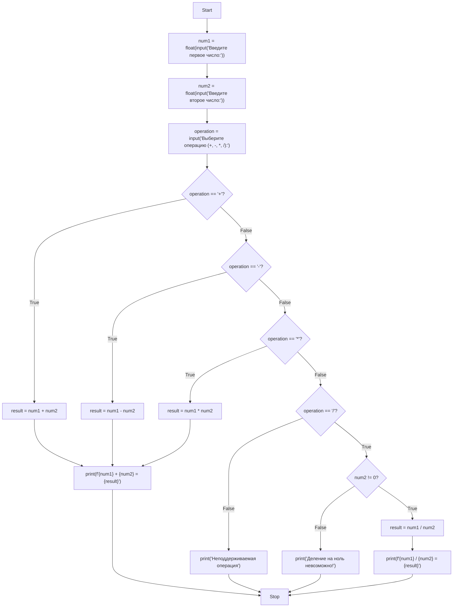

```python
num1 = float(input("Введите первое число: "))
num2 = float(input("Введите второе число: "))
operation = input("Выберите операцию (+, -, *, /): ")

if operation == "+":
    result = num1 + num2
    print(f"{num1} + {num2} = {result}")
elif operation == "-":
    result = num1 - num2
    print(f"{num1} - {num2} = {result}")
elif operation == "*":
    result = num1 * num2
    print(f"{num1} * {num2} = {result}")
elif operation == "/":
    if num2 != 0:
        result = num1 / num2
        print(f"{num1} / {num2} = {result}")
    else:
        print("Деление на ноль невозможно!")
else:
    print("Неподдерживаемая операция")
```

### Пример 3: Система оценки студентов

Этот пример показывает, как можно использовать последовательность `if-elif-else` для классификации данных:

```mermaid
flowchart TD
    A[Start] --> B[score = int(input("Введите оценку (0-100):"))]
    B --> C{score >= 90?}
    C -->|True| D[grade = "A"]
    C -->|False| E{score >= 80?}
    D --> F[print(f"Ваша оценка: {grade}")]
    E -->|True| G[grade = "B"]
    E -->|False| H{score >= 70?}
    G --> F
    H -->|True| I[grade = "C"]
    H -->|False| J{score >= 60?}
    I --> F
    J -->|True| K[grade = "D"]
    J -->|False| L[grade = "F"]
    K --> F
    L --> F
    F --> M[Stop]
```

```python
score = int(input("Введите оценку (0-100): "))

if score >= 90:
    grade = "A"
elif score >= 80:
    grade = "B"
elif score >= 70:
    grade = "C"
elif score >= 60:
    grade = "D"
else:
    grade = "F"

print(f"Ваша оценка: {grade}")
```

### Пример 4: Проверка високосного года

В этом примере используется комбинация логических операторов для проверки сложного условия:

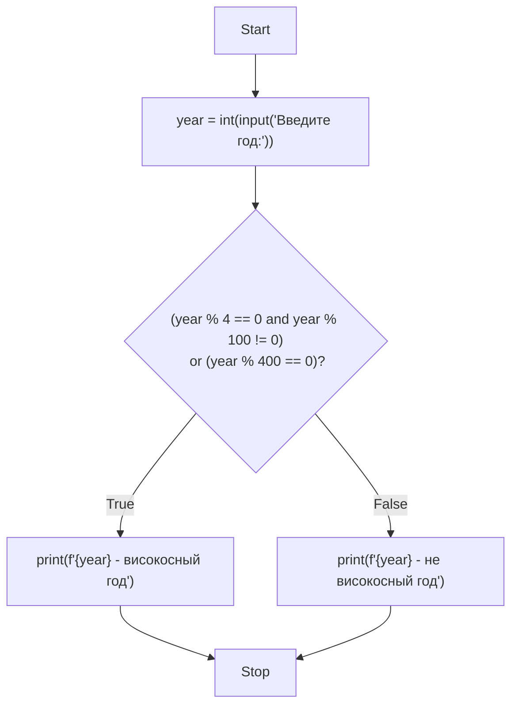

```python
year = int(input("Введите год: "))

if (year % 4 == 0 and year % 100 != 0) or (year % 400 == 0):
    print(f"{year} - високосный год")
else:
    print(f"{year} - не високосный год")
```

### Пример 5: Система скидок

В этом примере демонстрируется использование вложенных условий и логических операторов для определения размера скидки:

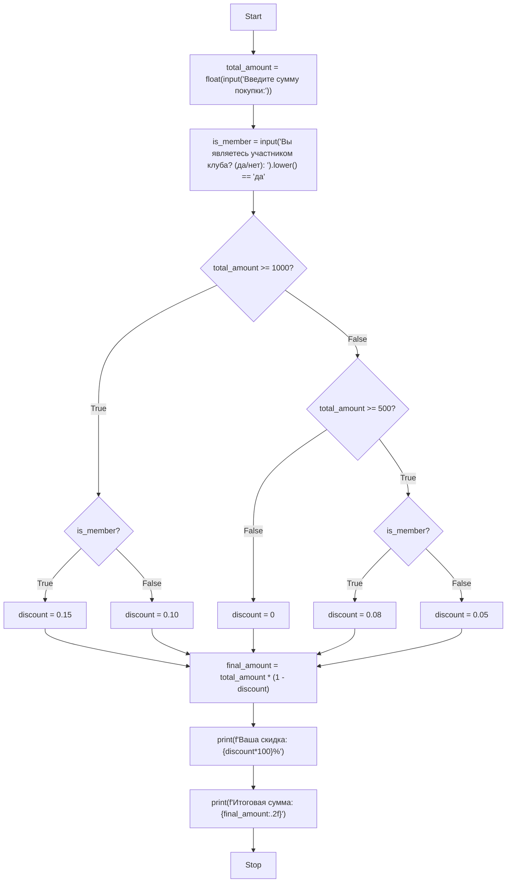

```python
total_amount = float(input("Введите сумму покупки: "))
is_member = input("Вы являетесь участником клуба? (да/нет): ").lower() == "да"

if total_amount >= 1000:
    if is_member:
        discount = 0.15  # 15% скидка для участников
    else:
        discount = 0.10  # 10% скидка для обычных клиентов
elif total_amount >= 500:
    if is_member:
        discount = 0.08  # 8% скидка для участников
    else:
        discount = 0.05  # 5% скидка для обычных клиентов
else:
    discount = 0  # Нет скидки

final_amount = total_amount * (1 - discount)
print(f"Ваша скидка: {discount*100}%")
print(f"Итоговая сумма: {final_amount:.2f}")
```

## Заключение

Условные конструкции являются важным инструментом для управления потоком выполнения программы. Они позволяют создавать гибкий код, который может адаптироваться к различным ситуациям. Понимание работы с логическими операторами и преобразованием типов в условиях помогает писать более эффективный и безопасный код.
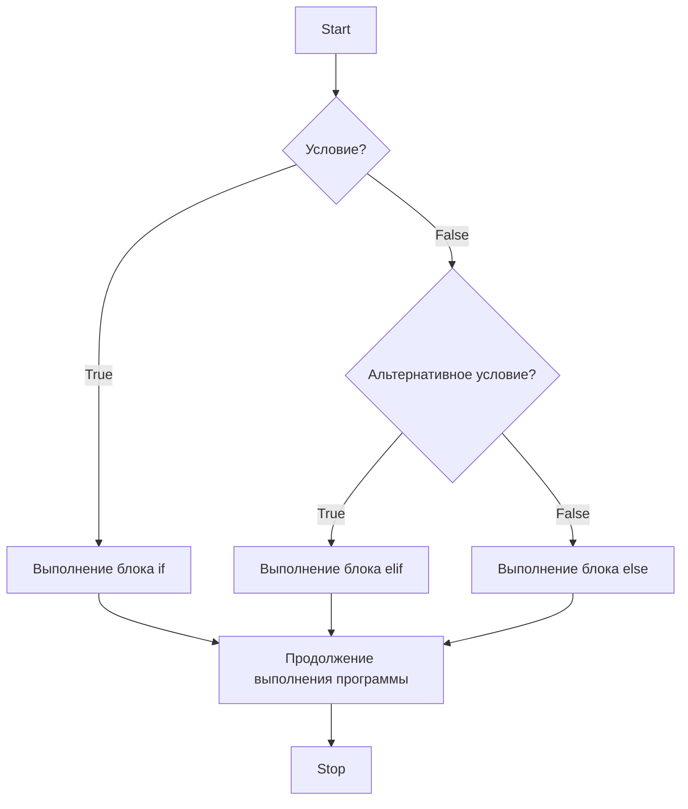

На этой лекции мы рассмотрели следующие ключевые моменты:

1. **Операторы ветвления**: `if`, `elif`, `else` - основные элементы условных конструкций, позволяющие программе принимать решения на основе проверки условий.

2. **Вложенные условия**: возможность размещения одного условного блока внутри другого для создания более сложной логики.

3. **Логические операторы**: `and`, `or`, `not` - позволяют комбинировать простые условия в более сложные логические выражения.

4. **Приоритет операторов**: знание приоритета логических операторов (`not` > `and` > `or`) помогает правильно строить сложные условия и избегать ошибок.

5. **Приведение типов в условиях**: понимание того, какие значения в Python считаются "истинными", а какие "ложными", позволяет писать более компактный и читаемый код.

6. **Явное преобразование типов**: необходимость преобразования типов при работе с пользовательским вводом и внешними данными.

7. **Безопасность при преобразовании**: важность обработки исключений при преобразовании типов для создания надежных программ.

Условные конструкции - это фундаментальный элемент программирования, без которого невозможно создать ни одну серьезную программу. Они позволяют вашему коду "думать" и принимать решения на основе входных данных или состояния программы. Умение эффективно использовать условные конструкции - один из ключевых навыков программиста.

Практика использования условных конструкций поможет вам лучше понимать логику программ и строить более сложные алгоритмы. Помните, что хорошо спроектированные условия делают код более понятным и поддерживаемым.
